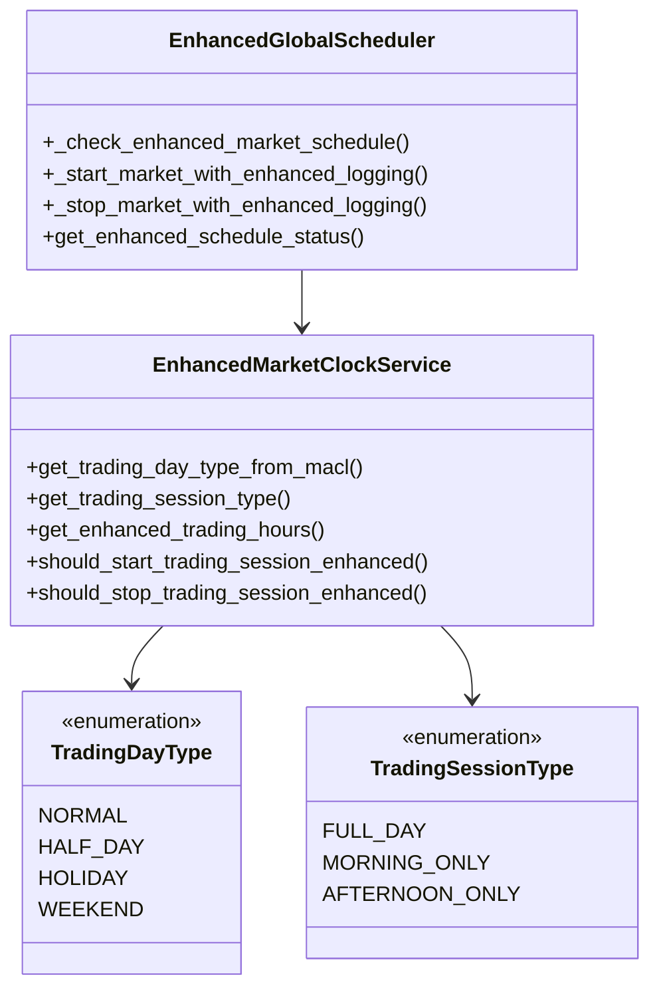

# MACL交易日类型集成部署指南

## 📋 功能概述

本次集成为代理池系统添加了基于MACL当日数据的交易日类型判断功能，支持全日交易和半日交易模式的自动代理池管理。

### 🎯 核心功能

1. **交易日类型判断**: 基于MACL逻辑判断交易日类型（正常/半日/假期/周末）
2. **增强市场时钟**: 支持全日/半日交易时间配置
3. **智能代理池管理**: 根据交易日类型自动启动/停止代理池
4. **RESTful API**: 提供完整的API接口支持
5. **向后兼容**: 保持与现有系统的完全兼容

---

## 🏗️ 架构变更

### 新增组件

```
proxy-pool/
├── src/infrastructure/
│   ├── enhanced_market_clock.py          # 增强市场时钟服务
│   ├── enhanced_global_scheduler.py      # 增强全局调度器
│   └── dependencies.py                   # 更新依赖注入
├── src/api/routes/
│   └── enhanced_proxy_pool_routes.py     # 增强API接口
└── scripts/
    └── test_macl_integration.py          # 集成测试脚本
```

### 核心类图



---

## 🚀 部署步骤

### 1. 代码部署

```bash
# 确保所有新文件已部署到服务器
cp src/infrastructure/enhanced_market_clock.py /path/to/proxy-pool/src/infrastructure/
cp src/infrastructure/enhanced_global_scheduler.py /path/to/proxy-pool/src/infrastructure/
cp src/api/routes/enhanced_proxy_pool_routes.py /path/to/proxy-pool/src/api/routes/
```

### 2. 更新主应用

在主应用文件中集成增强组件：

```python
# src/main.py 或 src/app.py 中添加
from infrastructure.dependencies import (
    initialize_enhanced_components,
    set_enhanced_global_scheduler,
    set_enhanced_market_clock
)
from infrastructure.enhanced_market_clock import EnhancedMarketClockService
from infrastructure.enhanced_global_scheduler import EnhancedGlobalScheduler

# 在应用启动时初始化增强组件
async def startup_event():
    # 现有初始化代码...

    # 初始化增强组件
    initialize_enhanced_components()

    # 启动增强调度器
    enhanced_scheduler = get_enhanced_global_scheduler()
    if enhanced_scheduler:
        await enhanced_scheduler.start()

# 在应用关闭时清理
async def shutdown_event():
    enhanced_scheduler = get_enhanced_global_scheduler()
    if enhanced_scheduler:
        await enhanced_scheduler.stop()
```

### 3. 注册增强API路由

```python
# 在FastAPI应用中注册新的API路由
from api.routes.enhanced_proxy_pool_routes import router_enhanced

app.include_router(router_enhanced, prefix="/api/v1")
```

### 4. 环境变量配置

```bash
# .env 文件中添加
ENABLE_ENHANCED_TRADING_FEATURES=true
ENHANCED_MARKET_CLOCK_ENABLED=true
MACL_FALLBACK_ENABLED=true

# 半日交易配置
HALF_DAY_TRADING_ENABLED=true
HALF_DAY_CN_MORNING="09:30-11:30"
HALF_DAY_HK_MORNING="09:30-12:00"
HALF_DAY_US_MORNING="09:30-13:00"
```

---

## 🔧 配置选项

### 交易时间配置

```python
# 在enhanced_market_clock.py中可自定义半日交易时间
half_day_trading_hours = {
    "cn": {
        "morning_only": ("09:30", "11:30"),  # 中国半日：仅上午
        "afternoon_only": ("13:00", "15:00")  # 中国半日：仅下午
    },
    "hk": {
        "morning_only": ("09:30", "12:00"),  # 香港半日：仅上午
        "afternoon_only": ("13:00", "16:00")  # 香港半日：仅下午
    },
    "us": {
        "morning_only": ("09:30", "13:00"),  # 美股半日：仅上半段
        "afternoon_only": ("13:00", "16:00")  # 美股半日：仅下半段
    }
}
```

### 半日交易日期配置

```python
# 可在_is_half_day_by_macl方法中自定义半日交易日期
def _is_half_day_by_macl(self, market: str, date: datetime) -> bool:
    market = market.lower()
    month_day = date.strftime("%m-%d")

    if market == "hk":
        # 香港半日交易日期
        half_day_dates = ["12-24", "12-31"]  # 平安夜、除夕
        return month_day in half_day_dates

    elif market == "us":
        # 美股半日交易日期
        half_day_dates = ["11-29", "12-24"]  # 感恩节后、平安夜
        return month_day in half_day_dates

    # 其他市场配置...
```

---

## 🧪 测试验证

### 1. 运行集成测试

```bash
cd /path/to/proxy-pool
python scripts/test_macl_integration.py
```

### 2. API测试

```bash
# 测试交易日类型查询
curl -X GET "http://localhost:8000/api/v1/enhanced/trading-day/cn"

# 测试MACL数据获取
curl -X GET "http://localhost:8000/api/v1/enhanced/macl/day-type/hk?date=2024-12-24"

# 测试增强调度器状态
curl -X GET "http://localhost:8000/api/v1/enhanced/scheduler/status"
```

### 3. 功能验证清单

- [ ] 交易日类型正确判断（正常/半日/假期/周末）
- [ ] 半日交易时间配置生效
- [ ] 代理池根据交易日类型正确启停
- [ ] API接口正常响应
- [ ] 日志记录包含交易日类型信息
- [ ] 向后兼容性验证

---

## 📊 监控和日志

### 关键日志事件

```
# 启动日志示例
🚀 Starting market CN - 半日交易(仅上午) trading session begins
📋 CN Trading hours: 09:30 - 11:30
✅ Market CN started successfully (半日交易(仅上午))

# 停止日志示例
🛑 Stopping market HK - 正常交易日 trading session ends
✅ Market HK stopped successfully (正常交易日)
📅 Market HK next start: 2025-09-19 09:00 (正常交易日, in 18h 30m)
```

### 监控指标

- 交易日类型检测准确性
- 代理池启停响应时间
- MACL回退使用频率
- API接口响应时间

---

## 🔄 回滚计划

如需回滚到原有系统：

1. **停用增强调度器**
   ```python
   # 在startup中注释掉增强组件初始化
   # initialize_enhanced_components()
   ```

2. **移除API路由**
   ```python
   # 注释掉增强API路由注册
   # app.include_router(router_enhanced, prefix="/api/v1")
   ```

3. **恢复原有调度器**
   ```python
   # 确保原有调度器正常运行
   scheduler = get_global_scheduler()
   await scheduler.start()
   ```

---

## 🎯 后续扩展计划

### 1. 交易日历数据库集成

```python
# 后续可扩展为从交易日历数据库读取
async def get_trading_day_type_from_calendar_db(self, market: str, date: datetime):
    # 从市场数据服务的交易日历读取审核后的数据
    # 当无审核数据时回退到MACL逻辑
    pass
```

### 2. 更多市场支持

- 新加坡市场 (SG)
- 日本市场 (JP)
- 韩国市场 (KR)
- 欧洲市场 (EU)

### 3. 动态配置

- 支持运行时修改半日交易时间
- 支持动态添加特殊交易日期
- 支持实时交易日历更新

---

## 📞 技术支持

**联系方式**: dev@saturn-mousehunter.com
**文档版本**: v1.0
**发布日期**: 2025-09-18
**兼容性**: 与现有proxy-pool系统完全兼容

---

*本部署指南提供了完整的MACL交易日类型集成功能部署步骤，确保系统平滑过渡和稳定运行。*